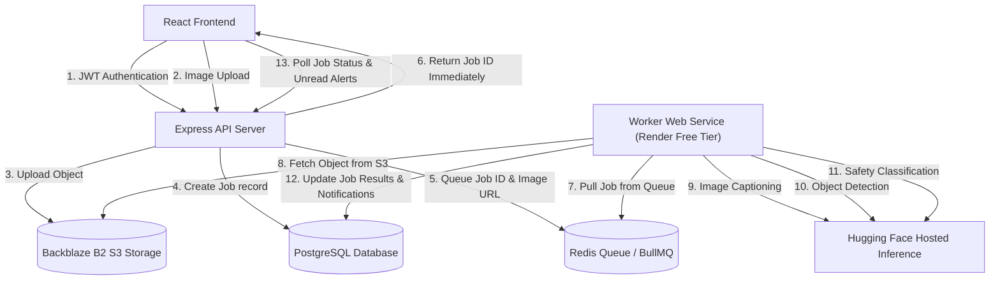
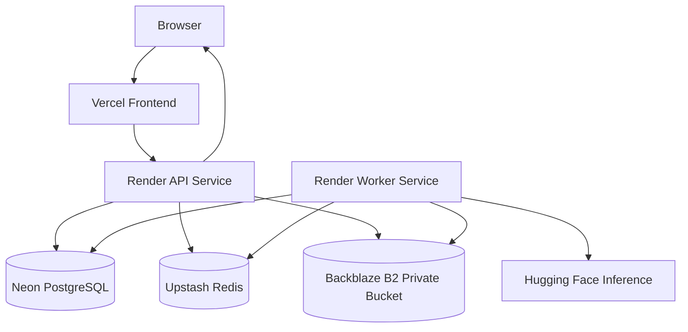

# AI-Powered Media Processing Platform

An asynchronous, queue-based media processing microservice platform. Authenticated users upload images, which are durably stored, enqueued, and processed in the background through a sequential three-step AI pipeline (Image Captioning, Object Detection, and Content Safety Checks) while returning the Job ID immediately.

---

## Live Deployment

| Service | URL |
| :--- | :--- |
| Frontend Application | https://media-processor-ai.vercel.app |
| API Service | https://mediaprocessor-ai.onrender.com |
| Worker Service Health Endpoint | https://mediaprocessor-ai-1.onrender.com |
| API Health Check | https://mediaprocessor-ai.onrender.com/health |
| OpenAPI Spec | https://mediaprocessor-ai.onrender.com/api-docs/openapi.json |

Production services are deployed as separate components: the React frontend runs on Vercel, the Express API and BullMQ worker run as independent Render services, PostgreSQL runs on Neon, Redis runs on Upstash, and uploaded images are stored in a private Backblaze B2 bucket.

---

## 1. Architecture Diagram

The system architecture decouples user-facing web servers from resource-intensive AI processing steps using a Redis-backed BullMQ message queue.



---

### 2. Architectural Decisions & Tradeoffs

Below is the documentation of major architectural decisions, including alternatives, tradeoffs, and final choices:

### Authentication (Why JWT)
* **Final Choice**: JSON Web Tokens (JWT).
* **Justification & Tradeoffs**: Session-based cookie auth requires a shared session store (like Redis) or database lookup on every request, creating scale bottlenecks. JWT is stateless, self-contained, and cryptographically verified by the API instance using a shared secret (`JWT_SECRET`). 
* **Tradeoff**: JWT invalidation is difficult without a token blocklist. Since this task represents a low-risk media processing dashboard, stateless JWT represents the best balance between ease-of-scaling and complexity.

### Queue Technology (Why BullMQ)
* **Final Choice**: Redis + BullMQ.
* **Justification & Tradeoffs**: BullMQ is the industry-standard queue for Node.js/TypeScript. It natively supports atomic operations, automated retries with exponential backoffs, concurrency limits, and parent-child dependency tracking.
* **Tradeoff**: Requires a running Redis instance, but Upstash Redis offers a highly scalable managed serverless tier that fits within the budget.

### Storage Strategy (Why Backblaze B2)
* **Final Choice**: Backblaze B2 (S3-compatible object storage).
* **Justification & Tradeoffs**: Replaced the local shared-disk volumes with Backblaze B2. This completely decouples the API and Worker containers. The API uploads files directly to B2 via S3-compatible APIs and unlinks local files immediately, while the Worker fetches B2 objects into ephemeral container memory/disk on-demand.
* **Tradeoff**: Introduces minor network latency for file downloading inside the worker, but completely eliminates the need for expensive network filesystems (NFS) and allows scaling both services to infinite stateless containers.

### Database (Why PostgreSQL)
* **Final Choice**: Neon Serverless PostgreSQL.
* **Justification & Tradeoffs**: Relational schema ensures strict transactional integrity for users, jobs, and notifications. Prisma ORM provides type-safety and robust schema synchronization.
* **Tradeoff**: Serverless databases can experience cold-start latency, which we mitigate by leveraging connection pooling.

### Status Update Strategy (Why Polling instead of WebSockets)
* **Final Choice**: React Query Polling (5-second interval).
* **Justification & Tradeoffs**: WebSockets require stateful persistent connections, necessitating sticky sessions and connection brokers (e.g., Redis Adapter, Socket.io brokers) when running 5+ API instances. Polling is stateless, compatible with any CDN/load balancer, and automatically halts once jobs reach terminal states (`completed` or `failed`).
* **Tradeoff**: Higher request rate on the API, which we mitigate via indexing and lightweight JSON query endpoints.

### AI Provider Strategy (Why Hugging Face instead of Google Vision)
* **Final Choice**: Hugging Face hosted inference for captioning, object detection, and safety classification.
* **Justification & Tradeoffs**: Google Cloud Vision API requires billing setup, which makes local testing difficult for reviewers. Hugging Face is free, allows model configuration via env vars, and rotates API tokens dynamically.
* **Tradeoff**: Hosted inference is subject to rate-limiting and model routing shifts, which we mitigate by using a rotating Hugging Face token pool.

### Database Migrations Decoupling (Why removed from startup)
* **Final Choice**: Separate DB Push release phase.
* **Justification & Tradeoffs**: Running `npx prisma db push` inside the API startup script is safe for single-node setups, but causes race conditions when scaling to **5 API instances** concurrently. Concurrently executed migrations cause transaction locks and container boot crashes. Decoupling push scripts ensures that schema synchronization runs exactly once per deploy release.

---

## 3. Technology Choices

* **Frontend**: React, Vite, TypeScript, Tailwind CSS, TanStack React Query, Axios, React Router.
* **Backend**: Node.js, Express, TypeScript, Prisma ORM, JWT, Multer.
* **Database & Caching**: PostgreSQL, Redis, BullMQ.
* **AI Services**: Hugging Face hosted inference for captioning, object detection, and content safety.
* **Storage**: Backblaze B2 private S3-compatible object storage.
* **Containerization**: Docker, Docker Compose.
* **Testing**: Vitest unit tests and Supertest API integration tests.

---

## 4. Local Setup (Without Docker)

To run the application services locally on your host machine:

### Prerequisites
* Node.js v20+
* PostgreSQL running locally (default port `5432` or similar)
* Redis running locally (default port `6379`)

### Setup Instructions
1. Clone the repository and navigate to the project root.
2. Create a `.env` file in the root based on `.env.example`.
3. Install backend dependencies and run migrations:
   ```bash
   cd backend
   npm install
   # Set DATABASE_URL to localhost:5432 in your .env
   npx prisma db push
   ```
4. Start backend services (open two terminals):
   * Terminal 1 (API Server): `npm run dev:api`
   * Terminal 2 (Worker): `npm run dev:worker`
5. Install frontend dependencies and start Vite:
   ```bash
   cd ../frontend
   npm install
   npm run dev
   ```
6. Open your browser to `http://localhost:3000`.

---

## 5. Docker Setup (Recommended)

Spins up the backend processing stack (Express API, BullMQ Worker, PostgreSQL, and Redis) locally with a single command. The frontend is started separately with Vite so reviewers can point it at either the local API or the deployed API.

### Prerequisites
* Docker and Docker Compose installed.

### Setup Instructions
1. Create a `.env` file in the root and fill in your keys:
   ```env
   HUGGINGFACE_API_KEY=your_huggingface_api_key
   HUGGINGFACE_API_KEY_2=your_second_huggingface_api_key_optional
   # Or use HUGGINGFACE_API_KEYS=key_one,key_two,key_three
   APP_TIME_ZONE=Asia/Kolkata
   HUGGINGFACE_CAPTION_MODEL=meta-llama/Llama-4-Scout-17B-16E-Instruct:groq
   HUGGINGFACE_CAPTION_PROMPT=Describe this image in exactly one detailed sentence. Do not use bullet points, multiple sentences, or line breaks.
   HUGGINGFACE_CAPTION_MAX_TOKENS=45
   HUGGINGFACE_IMAGE_MAX_EDGE=768
   HUGGINGFACE_IMAGE_QUALITY=78
   HUGGINGFACE_IMAGE_MAX_BYTES=900000
   JOB_STALE_PROCESSING_MINUTES=15
   HUGGINGFACE_DETECTION_MODEL=facebook/detr-resnet-50
   HUGGINGFACE_DETECTION_THRESHOLD=0.5
   HUGGINGFACE_LABEL_MODEL=meta-llama/Llama-4-Scout-17B-16E-Instruct:groq
   HUGGINGFACE_LABEL_MAX_COUNT=3
   HUGGINGFACE_SAFETY_MODEL=Falconsai/nsfw_image_detection
   HUGGINGFACE_SAFETY_THRESHOLD=0.7
   HUGGINGFACE_SAFETY_REVIEW_MODEL=meta-llama/Llama-4-Scout-17B-16E-Instruct:groq
   HUGGINGFACE_SAFETY_REVIEW_THRESHOLD=0.5
   ```
2. Run the compose environment:
   ```bash
   docker-compose up --build
   ```
3. Docker will compile the TypeScript source files and launch the backend services:
   * **Express API Server**: Accessible on `http://localhost:5000`
   * **BullMQ Worker**: Runs as a separate service consuming Redis jobs
   * **PostgreSQL Database**: Port `5472` on host
   * **Redis Server**: Port `6379` on host
4. Run the frontend locally:
   ```bash
   cd frontend
   npm install
   npm run dev
   ```

---

## 6. Environment Variables

Define the following environment variables in a root `.env` or container settings:

| Variable | Description | Default / Local |
| :--- | :--- | :--- |
| `PORT` | API Server listening port | `5000` |
| `DATABASE_URL` | PostgreSQL connection URL | `postgresql://postgres:postgres_password@db:5432/mediadb` |
| `REDIS_URL` | Redis server connection URL | `redis://redis:6379` |
| `JWT_SECRET` | Signing secret for user authentication | `super_secret_jwt_key_replace_in_prod` |
| `APP_TIME_ZONE` | Local timezone used for dashboard daily upload bucketing | `Asia/Kolkata` |
| `STORAGE_PROVIDER` | File storage provider | `local` |
| `UPLOAD_DIR` | Shared uploads directory | `uploads` |
| `S3_ACCESS_KEY_ID` | S3 / Backblaze B2 credential Key ID | empty |
| `S3_SECRET_ACCESS_KEY` | S3 / Backblaze B2 Application Key | empty |
| `S3_ENDPOINT` | S3 S3-compatible API endpoint URL | empty |
| `S3_BUCKET_NAME` | S3 S3-compatible bucket name | empty |
| `S3_PUBLIC_URL` | (Deprecated/Unused) All assets are now securely streamed via the API proxy | empty |
| `CORS_ORIGIN` | Allowed CORS origins (comma-separated for multiple); set to your frontend URL in production | `*` |
| `HUGGINGFACE_API_KEY` | Hugging Face token with Inference Providers permission | Create at `https://huggingface.co/settings/tokens` |
| `HUGGINGFACE_API_KEY_2` | Optional second Hugging Face token; requests rotate across configured keys | empty |
| `HUGGINGFACE_API_KEYS` | Optional comma-separated Hugging Face token pool; deduped with numbered keys | empty |
| `HUGGINGFACE_CAPTION_MODEL` | Hosted HF router model for image captioning | `meta-llama/Llama-4-Scout-17B-16E-Instruct:groq` |
| `HUGGINGFACE_CAPTION_PROMPT` | Prompt sent with the image for one-line captioning | `Describe this image in exactly one detailed sentence. Do not use bullet points, multiple sentences, or line breaks.` |
| `HUGGINGFACE_CAPTION_MAX_TOKENS` | Maximum caption response tokens requested from the provider | `45` |
| `HUGGINGFACE_IMAGE_MAX_EDGE` | Longest image edge sent to Hugging Face after optimization | `768` |
| `HUGGINGFACE_IMAGE_QUALITY` | JPEG quality used for provider payload optimization | `78` |
| `HUGGINGFACE_IMAGE_MAX_BYTES` | Target maximum optimized image payload bytes before base64 encoding | `900000` |
| `JOB_STALE_PROCESSING_MINUTES` | Worker startup recovery threshold for interrupted `processing` jobs | `15` |
| `HUGGINGFACE_DETECTION_MODEL` | Hosted HF object detection model | `facebook/detr-resnet-50` |
| `HUGGINGFACE_DETECTION_THRESHOLD` | Minimum object confidence persisted as a label | `0.5` |
| `HUGGINGFACE_LABEL_MODEL` | Hosted HF vision-language model for richer visible labels | `meta-llama/Llama-4-Scout-17B-16E-Instruct:groq` |
| `HUGGINGFACE_LABEL_MAX_COUNT` | Maximum persisted semantic labels (subjects, actions, objects) | `6` |
| `HUGGINGFACE_SAFETY_MODEL` | Hosted HF image safety classifier | `Falconsai/nsfw_image_detection` |
| `HUGGINGFACE_SAFETY_THRESHOLD` | Minimum unsafe confidence before `flagged=true` | `0.7` |
| `HUGGINGFACE_SAFETY_REVIEW_MODEL` | Hosted HF vision-language model for abuse/violence/self-harm/distress safety review | `meta-llama/Llama-4-Scout-17B-16E-Instruct:groq` |
| `HUGGINGFACE_SAFETY_REVIEW_THRESHOLD` | Minimum visual safety review confidence before `flagged=true` | `0.5` |

To obtain tokens, create or sign in to a Hugging Face account, open **Settings -> Access Tokens**, create fine-grained tokens, and enable permission to make calls to Inference Providers. Use one token as `HUGGINGFACE_API_KEY`; add `HUGGINGFACE_API_KEY_2` or `HUGGINGFACE_API_KEYS` when you want requests distributed across multiple tokens.

### Frontend Environment Variable

| Variable | Description | Default / Local |
| :--- | :--- | :--- |
| `VITE_API_URL` | Backend API base URL used by the React frontend at build time | `http://localhost:5000` |

For the deployed Vercel frontend, `VITE_API_URL` is set to `https://mediaprocessor-ai.onrender.com`.

---

## 7. API Documentation

Complete details are available in OpenAPI format:

* **Local**: `http://localhost:5000/api-docs/openapi.json`
* **Production**: `https://mediaprocessor-ai.onrender.com/api-docs/openapi.json`

Below is a summary:

### Authentication
* `POST /auth/register` - Create user account (returns JWT).
* `POST /auth/login` - Authenticate credentials (returns JWT).
* `GET /auth/me` - Fetch profile metadata for the authenticated user.
* `POST /auth/logout` - Invalidate current session.

### Jobs
* `POST /jobs/upload` - Upload image (JPG, PNG, WEBP, <= 5MB) via multipart-form under `image` field. Returns Job ID immediately.
* `GET /jobs` - Retrieve user's jobs history (supports `page` and `limit` query parameters).
* `GET /jobs/:id` - Fetch comprehensive results for a single Job ID.
* `POST /jobs/:id/retry` - Re-enqueue a failed job.

### Notifications
* `GET /notifications` - Fetch user in-app notifications.
* `PATCH /notifications/read-all` - Mark all notifications as read.
* `PATCH /notifications/:id/read` - Mark a single notification as read.

---

## 8. CI/CD Workflow

The repository is configured with a GitHub Actions workflow in `.github/workflows/ci-cd.yml`:
1. Installs backend dependencies.
2. Generates the Prisma client.
3. Executes the automated backend test suite (`npm run test` inside `backend`), including Vitest unit tests and Supertest API integration tests.
4. Compiles backend TypeScript.
5. Installs frontend dependencies.
6. Builds the Vite frontend assets.
7. Halts integration branch deployment if any step fails.

---

## 9. Deployment Architecture



* **Frontend**: Vercel static deployment at `https://media-processor-ai.vercel.app`.
* **API**: Render Web Service at `https://mediaprocessor-ai.onrender.com`.
* **Worker**: Independent Render Web Service at `https://mediaprocessor-ai-1.onrender.com`; it binds a lightweight HTTP endpoint for Render health checks while consuming BullMQ jobs in the background.
* **Database**: Neon PostgreSQL.
* **Queue**: Upstash Redis.
* **Storage**: Backblaze B2 private bucket, accessed server-side through S3-compatible APIs.
* **AI Provider**: Hugging Face hosted inference.

---

## 10. Scalability Discussion & Production Scaling Strategy

How the system behaves under 10x traffic:

### Horizontal Scale Rationale (5 API & 20 Worker Instances)
The system is built to scale up to **5 API instances** and **20 Worker instances** without modification:
1. **API Nodes (Horizontal Ingress)**:
   - 5 API nodes can run behind a standard load balancer. Because authentication is stateless (JWT) and uploads are immediately offloaded to Backblaze B2, any API node can service any HTTP request.
   - Database migrations (`npm run db:push`) are decoupled from container startup, preventing race conditions or schema sync locks.
2. **Worker Nodes (Horizontal Processing)**:
   - 20 Worker instances can listen concurrently to the same Upstash Redis / BullMQ queue. BullMQ handles atomic job locking, ensuring that each job is processed exactly once by a single worker.
   - Workers download files to their own local container temp folders (`/tmp`), ensuring zero disk crosstalk or container contention.

### Redis Queue Isolation
The Redis server has extremely high throughput capabilities (over 10,000 requests/sec). Using Redis as an asynchronous buffer prevents Express API threads from locking, keeping the user interface snappy even under sudden upload spikes. Memory consumption is mitigated by deleting completed jobs from Redis memory automatically (`removeOnComplete: true`).

### Database Optimization
Under heavy traffic, direct database queries from multiple workers could saturate PostgreSQL connections. We mitigate this in production by:
- Using Neon connection pool routing (using transaction ports).
- Adding database indexes on `userId` and `createdAt` columns (supported in our schema design).

### Storage Consideration & Decoupling
By replacing local disk storage with Backblaze B2 (or any S3-compatible storage), the system removes the shared filesystem volume constraint entirely. This yields several scaling advantages:
- **Stateless Services**: Both API and Worker processes are completely stateless and can run in any cloud or container platform (e.g., AWS ECS/Fargate, Google Cloud Run) without requiring distributed network filesystems.
- **Independent Scaling**: If a surge of uploads occurs, the API service scales up to handle ingress traffic, while the Worker instances scale independently according to Redis queue depth.
- **Next-Step Optimization (Presigned URLs)**: To scale even further, the architecture can be updated to generate S3 presigned upload URLs, allowing client browsers to upload images directly to the S3 bucket. This would completely bypass the API server for image data transfer, offloading network and I/O pressure entirely from our API nodes.

---

## 11. Worker Startup Recovery Tradeoffs & Production Scheduler Recommendation

In this implementation, worker recovery is triggered on container boot (`recoverInterruptedJobs()`).

### Concurrency Tradeoff & Limitations
- **The Issue**: When booting **20 Worker instances** concurrently, all 20 processes will attempt to execute database recovery queries at the same time. This leads to Postgres table write locks and potential duplicate job insertions in the queue.
- **Production Recommendation**:
  For production setups, startup-based recovery should be disabled. The recovery logic should be scheduled to run as a single-instance cron task every 10–15 minutes using an external orchestrator:
  - **Cloudflare Worker Crons**: A scheduled serverless function calling an administrative recovery API endpoint on the backend.
  - **Upstash QStash**: Serverless messaging scheduler that fires HTTP POST requests to trigger recovery.
  - **Dedicated Manager Container**: A single-instance worker container running a scheduled task helper like `cron` or `node-cron`.

---

## 12. Assumptions & Limitations

1. **File Uploads**: Images are uploaded via standard Multer multipart POST to the API server, which uploads them to Backblaze B2 (or other S3 bucket) and deletes the local temporary file immediately. The Worker receives the S3 object reference via the Redis queue, downloads the file from S3 to ephemeral container storage, processes it, and cleans it up. No shared filesystem is used.
2. **Safety Flags**: The safety step uses `Falconsai/nsfw_image_detection` for sexual/explicit image risk and a required Hugging Face visual safety review for abuse, violence, self-harm, severe distress, exploitation, and child/minor harm. If either required safety step fails, the job fails instead of pretending the image is safe.
3. **Provider Fail-Fast Behavior**: The worker fails the job if any hosted Hugging Face pipeline step fails after shared retry handling. BullMQ keeps the existing job retry behavior, so transient provider failures can be retried without changing the API contract.
4. **Image Payload Size**: Before each Hugging Face call, uploads are converted to bounded JPEG payloads to avoid request-size failures from large base64 image bodies.
5. **Interrupted Job Recovery**: On worker startup, pending jobs and stale `processing` jobs older than `JOB_STALE_PROCESSING_MINUTES` are re-queued so a worker restart cannot leave uploads stuck forever.
6. **Dashboard Dates**: The upload chart uses `APP_TIME_ZONE`, so a photo uploaded after local midnight is counted on the new local date even if UTC is still the previous day.
7. **Model Limitations**: `facebook/detr-resnet-50` detects COCO-style object classes for diagnostics, but persisted user-facing labels come from the stricter vision-language pass with semantic analysis (living beings, actions, important objects) capped at six labels. The label pass prioritizes subjects, activities, and contextual objects over trivial details. `Falconsai/nsfw_image_detection` is a binary/general NSFW classifier and should be treated as a screening aid, not a legal or policy authority.

---

## 13. Future Enhancements

1. **Presigned Upload URLs**: Generate direct-to-S3 client upload links to offload I/O traffic from API containers.
2. **Email Alerts**: Trigger transactional email warnings (using Amazon SES or Resend) when content is flagged.
3. **WebSocket Realtime Updates**: Supplement React Query polling with Socket.io connections for instant, lower-overhead progress bars on the dashboard.
4. **Advanced Retry Policies**: Support cron-based dead-letter-queue retries.
