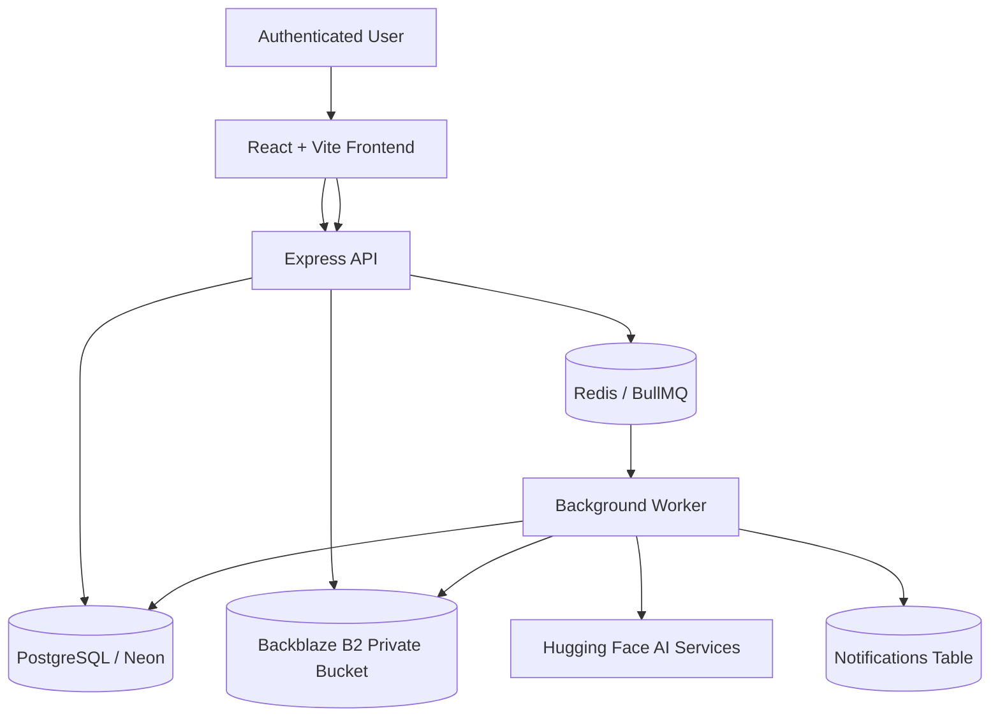
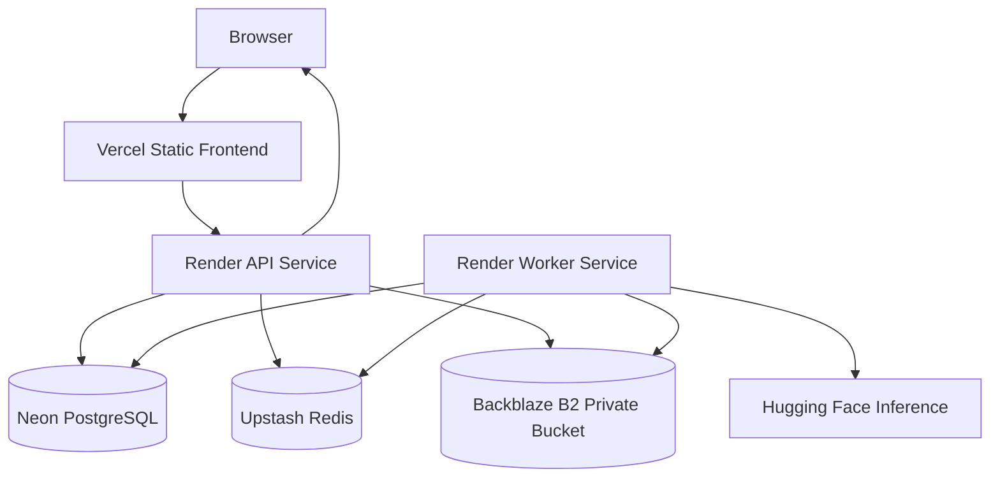

# AI-Powered Media Processing Microservice

## 1. Executive Summary

This project implements an AI-powered media processing platform for authenticated users. A user can sign up, log in, upload an image, receive a job ID immediately, and later inspect the AI-enriched result: a caption, detected labels, and a content-safety classification. The system is designed around the same core pattern used by production media platforms: accept user work quickly, persist it durably, process it asynchronously, and make the result queryable without blocking the request thread.

Asynchronous processing is required because the AI pipeline has unpredictable latency. Captioning, object detection, and safety classification each depend on external model providers and network calls. Running those steps inside the upload request would create long HTTP waits, gateway timeout risk, poor user experience, and low API throughput. Instead, the API performs only the fast path: authentication, validation, durable storage, job creation, and queue enqueueing. A separate worker consumes the job and updates PostgreSQL when processing completes.

The system uses a PERN-style stack with React, Vite, TypeScript, Node.js, Express, Prisma, PostgreSQL, Redis, BullMQ, Backblaze B2 object storage, and Hugging Face hosted inference. The deployment architecture uses Vercel for the frontend, Render for API and worker services, Neon PostgreSQL, Upstash Redis, and Backblaze B2 for private object storage.

## 2. Requirement Mapping

| Requirement | Implementation | Evidence |
| :--- | :--- | :--- |
| Users must sign up and log in. | Express auth routes create users, hash passwords with bcrypt, and return JWTs. | `backend/src/routes/auth.routes.ts`, `backend/src/controllers/auth.controller.ts`, `backend/src/utils/auth.ts` |
| All protected endpoints must reject unauthenticated requests. | Job and notification routers apply `authMiddleware`; `/auth/me` and logout also require JWT. | `backend/src/routes/job.routes.ts`, `backend/src/routes/notification.routes.ts`, `backend/src/middlewares/auth.middleware.ts` |
| Auth strategy must be documented and justified. | README documents JWT rationale and tradeoffs. | `README.md` |
| Accept only JPG, PNG, and WEBP. | Multer file filter allows `image/jpeg`, `image/png`, and `image/webp`; unsupported types return `INVALID_FILE_TYPE`. | `backend/src/middlewares/upload.middleware.ts` |
| Maximum file size must be 5 MB and enforced at API layer. | Multer enforces `fileSize: 5 * 1024 * 1024`; Supertest integration coverage verifies rejection. | `backend/src/middlewares/upload.middleware.ts`, `backend/src/tests/api.integration.test.ts` |
| Upload must assign a unique job ID, store the file, create a pending DB job, enqueue it, and return immediately. | Upload controller stores the file through `StorageService`, creates a `pending` Prisma job, enqueues BullMQ work, and returns `201` with `jobId`. | `backend/src/controllers/job.controller.ts`, `backend/src/queues/job.queue.ts` |
| Processing must run asynchronously. | API enqueues jobs; worker consumes Redis queue independently. | `backend/src/queues/job.queue.ts`, `backend/src/workers/job.worker.ts`, `backend/src/worker.ts` |
| Worker must call an external AI endpoint. | Worker invokes Hugging Face-backed caption, detection, and safety services. | `backend/src/services/ai.service.ts`, `backend/src/services/ai/*` |
| Pipeline must run captioning, label/object detection, and content safety checks. | Worker runs the three stages sequentially and persists caption, labels, flagged state, and category. | `backend/src/workers/job.worker.ts` |
| Results must be queryable. | Authenticated users can fetch job history and job details; job responses include caption, labels, status, safety fields, and image proxy URL. | `backend/src/controllers/job.controller.ts`, `frontend/src/pages/History.tsx` |
| UI must allow sign up and login. | React auth pages call `/auth/register` and `/auth/login`. | `frontend/src/pages/Register.tsx`, `frontend/src/pages/Login.tsx`, `frontend/src/contexts/AuthContext.tsx` |
| UI must allow image upload. | Upload page validates file type/size client-side and posts multipart image data to `/jobs/upload`. | `frontend/src/pages/UploadPage.tsx` |
| UI must show past jobs and statuses. | History and dashboard pages fetch job data and display status badges. | `frontend/src/pages/History.tsx`, `frontend/src/pages/Dashboard.tsx`, `frontend/src/pages/DashboardPage.tsx` |
| UI must show full job results. | Job inspector modal displays image, status, caption, labels, safety classification, and error state. | `frontend/src/pages/History.tsx`, `frontend/src/pages/Dashboard.tsx` |
| UI must retry failed jobs. | Failed job cards expose a retry action that calls `POST /jobs/:id/retry`. | `frontend/src/pages/History.tsx`, `frontend/src/pages/Dashboard.tsx`, `backend/src/controllers/job.controller.ts` |
| UI must reflect job status updates via polling or WebSockets. | React Query polling refreshes active jobs; upload page also polls the submitted job. | `frontend/src/pages/UploadPage.tsx`, `frontend/src/pages/History.tsx`, `frontend/src/pages/Dashboard.tsx` |
| Flag unsafe content and store category. | Safety result updates `flagged` and `flagCategory` on the job. | `backend/src/workers/job.worker.ts`, `backend/src/services/ai/safety.service.ts` |
| Flagged jobs must be surfaced distinctly. | UI shows distinct flagged badges and warning sections. | `frontend/src/pages/History.tsx`, `frontend/src/pages/Dashboard.tsx`, `frontend/src/pages/UploadPage.tsx` |
| Notify users about flagged uploads. | Worker creates in-app notifications for completed, failed, and flagged jobs; frontend has notifications page and unread indicator. | `backend/src/workers/job.worker.ts`, `backend/src/controllers/notification.controller.ts`, `frontend/src/pages/NotificationsPage.tsx` |
| Application stack must be MERN or PERN. | PERN-style implementation: PostgreSQL, Express, React, Node.js. | `backend/package.json`, `frontend/package.json`, `backend/prisma/schema.prisma` |
| Docker is mandatory. | Separate API and worker Dockerfiles plus Compose for API, worker, Redis, and PostgreSQL. | `backend/Dockerfile.api`, `backend/Dockerfile.worker`, `docker-compose.yml` |
| `docker-compose.yml` must spin up API, worker, queue, and database locally. | Compose defines `api`, `worker`, `redis`, and `db`, with health checks and dependency ordering. | `docker-compose.yml` |
| API collection or OpenAPI/Swagger must be provided. | OpenAPI spec is served at `/api-docs/openapi.json`. | `backend/openapi.json`, `backend/src/api.ts` |
| README must cover architecture, local run, environment variables, assumptions, and limitations. | README contains architecture diagram, setup instructions, env documentation, tradeoffs, and limitations. | `README.md` |
| CI/CD choice must be documented. | GitHub Actions workflow installs dependencies, runs backend tests, compiles backend, and builds frontend. | `.github/workflows/ci-cd.yml` |
| Worker pipeline logic and retry behavior should be reasonably tested. | Unit tests cover queue options, stale job recovery, AI mapping, API key rotation, image optimization, and new integration tests cover retry endpoint behavior. | `backend/src/tests/app.test.ts`, `backend/src/tests/api.integration.test.ts` |

## 3. System Architecture

The architecture separates request handling from long-running processing. The API is optimized for fast authenticated writes and reads. The worker is optimized for slow, retryable, external AI work.

Request flow:

1. The user registers or logs in and receives a JWT.
2. The frontend stores the JWT and attaches it to API requests.
3. The user uploads an image through a multipart `/jobs/upload` request.
4. The API authenticates the request, validates the file type and size, and stores the image.
5. The API creates a PostgreSQL job row in `pending` status.
6. The API adds a BullMQ job to Redis using the database job ID as the queue job ID.
7. The API immediately returns the job ID to the user.
8. The worker pulls the job from Redis and marks the database job as `processing`.
9. The worker downloads the image from storage into ephemeral worker disk.
10. The worker runs captioning, object/label detection, and content-safety classification.
11. The worker updates the job row with `completed` or `failed` state and stores results or error details.
12. The worker creates a notification for completion, failure, or flagged content.
13. The frontend polls job endpoints and notification endpoints to update the UI.
14. Image previews load through an authenticated API proxy that validates job ownership before streaming the file.

## 4. Why This Architecture?

### Why asynchronous processing?

AI inference is slow and variable. The upload request should not wait for multiple external model calls. Returning a job ID immediately makes the system responsive, prevents gateway timeouts, and lets users continue using the app while processing happens in the background.

### Why queue-based architecture?

A queue decouples ingestion from processing. If 100 users upload images at once, the API only needs to validate, store, record, and enqueue. Redis absorbs the spike and workers process jobs at the rate the AI provider and infrastructure can handle.

### Why a separate worker?

The worker has different resource and failure characteristics than the API. It performs network-heavy AI calls, image optimization, storage downloads, retries, and database result writes. Keeping it separate prevents slow model calls from consuming API request capacity.

### Why not process images inside the API?

Doing so would couple user-facing latency to AI latency. It would also make API restarts more dangerous, because in-flight image processing could be interrupted inside HTTP request handlers. The queue and worker model gives each job a durable state transition path.

### Why Redis + BullMQ?

BullMQ provides job IDs, retry attempts, exponential backoff, active/completed/failed states, concurrency, and Redis-backed coordination with minimal boilerplate. For a Node.js take-home assignment, it gives production-relevant behavior while keeping local setup simple.

### Why PostgreSQL?

The domain has clear relationships: users own jobs, jobs produce notifications, and authorization depends on ownership. PostgreSQL provides strong relational integrity, uniqueness constraints, transactions, and predictable querying. Prisma adds type-safe access.

### Why React Query polling instead of WebSockets?

Polling is stateless and simple to deploy on free-tier infrastructure. Job status changes occur over seconds, not milliseconds, so 2 to 10 second polling is sufficient. WebSockets would add connection lifecycle management, sticky-session or broker concerns, and more operational complexity than the assignment requires.

### Why JWT?

JWT keeps API authentication stateless. The API can verify tokens without shared session storage, which fits horizontal API scaling and simple frontend deployment. The tradeoff is that token invalidation is not as immediate as server-side sessions; for this assignment, the simplicity is appropriate.

### Why Backblaze B2?

The system needs durable object storage that both the API and worker can access across separate machines. Backblaze B2 provides S3-compatible APIs, low cost, and a practical free-tier-friendly path. It also avoids local shared-disk coupling.

### Why private bucket architecture?

User uploads may contain personal or sensitive images. A public bucket would expose image URLs outside the app's auth model. The system keeps the bucket private and streams images through an authenticated API endpoint after validating job ownership.

### Why object storage instead of local disk?

Local disk only works when API and worker share a machine or a mounted volume. Object storage makes both services stateless: the API uploads the object, the worker downloads it later, and either service can run on different hosts.

## 5. Technology Decisions

| Technology | Alternatives | Decision Rationale |
| :--- | :--- | :--- |
| React | Vue, Angular, server-rendered templates | React is widely used, fits Vite and React Query well, and supports a responsive dashboard with predictable component composition. |
| Vite | Create React App, Next.js | Vite gives fast local development and simple static deployment. Next.js would add server-side concepts unnecessary for this client-heavy UI. |
| Tailwind CSS | CSS Modules, Material UI, Bootstrap | Tailwind allows fast, consistent UI implementation without adopting a large component framework. |
| Node.js | Python/FastAPI, Go, Java/Spring | Node.js is strong for I/O-heavy API and worker workloads and keeps API, worker, and frontend in TypeScript. |
| Express | NestJS, Fastify | Express is lightweight and enough for the assignment. NestJS would add structure but also boilerplate. |
| Prisma | TypeORM, Sequelize, raw SQL | Prisma provides type-safe queries, schema-driven modeling, and fast iteration for a take-home. |
| PostgreSQL | MongoDB, MySQL, SQLite | PostgreSQL fits ownership relationships, notifications, job state, and relational integrity better than document storage. |
| Redis | In-memory process queue, database polling, RabbitMQ, SQS | Redis works locally and in managed serverless form through Upstash. It integrates directly with BullMQ. |
| BullMQ | Bull, RabbitMQ, SQS, custom queue | BullMQ gives retries, backoff, concurrency, and job state with minimal code. RabbitMQ/SQS are valid but add more operational surface. |
| Backblaze B2 | Local disk, Cloudflare R2, S3, GCS | B2 gives S3-compatible durable storage and avoids the need for shared filesystem volumes. |
| Hugging Face | Google Cloud Vision, custom models, OpenAI Vision | Hugging Face supports hosted inference without GCP billing setup. The pipeline remains provider-modular. |

## 6. Security Design

### JWT Authentication

The API issues JWTs after successful registration or login. Passwords are hashed with bcrypt before storage. Protected endpoints verify bearer tokens through `authMiddleware`.

### Authorization

Authentication proves who the user is; authorization checks whether that user owns the resource. Job details, job retry, job delete, and job image streaming validate `job.userId === req.user.id`. Notification mutation endpoints apply the same ownership pattern.

### Job Ownership Validation

Ownership validation is enforced server-side. The frontend never decides which jobs a user may access; it only renders what the API returns. If a user tries another job ID, the API returns `403`.

### Private Bucket Strategy

Backblaze B2 is used as private object storage. The frontend does not receive storage credentials. The worker and API access B2 with server-side credentials configured through deployment environment variables.

### Image Proxy Endpoint

The frontend loads image previews from `/jobs/:id/image`. Because browser image tags cannot attach bearer headers easily, the API also supports a token query parameter for this image endpoint path. The server still verifies the JWT and the job owner before streaming bytes from storage.

Future hardening: replace query-token image loading with short-lived signed image proxy URLs or an HTTP-only cookie model to reduce token exposure in logs.

### Upload Validation

The API enforces accepted MIME types and file size through Multer. Client-side validation improves UX but is not trusted for security.

### Input Validation

Registration and login use Zod schemas for required fields, email format, and password length. Job and notification actions validate ownership before mutation.

### Secrets Management

Local `.env` files are ignored by Git. Production secrets are expected to live in Render, Vercel, Neon, Upstash, and Backblaze configuration. The default JWT secret is only suitable for local development and must be overridden in production.

## 7. Scalability Discussion

### Behavior under 10x load

At 10x upload traffic, the API should remain responsive because it does not run AI inference inline. It performs bounded work: authenticate, validate, upload to object storage, insert a row, enqueue a job, and return. Redis absorbs queue depth while workers process jobs independently.

### Horizontal worker scaling

Multiple workers can consume the same BullMQ queue. BullMQ uses Redis coordination so each job is locked and processed by one worker at a time. Increasing worker count improves throughput until a bottleneck is reached.

### Upload spikes

During upload spikes, the primary pressure points are API network bandwidth, B2 upload latency, database insert rate, and Redis enqueue throughput. Since processing is asynchronous, AI provider latency does not directly slow the upload response after enqueueing.

### Why Redis is useful

Redis gives a fast coordination layer between API and worker. It also stores retry state and job state transitions for BullMQ. Without Redis, the worker would need to poll the database or the API would need an in-process queue, both of which reduce reliability.

### Bottlenecks

Current bottlenecks:

- Hugging Face provider latency and rate limits.
- Worker concurrency and available Render instance resources.
- API upload bandwidth for multipart uploads.
- Database connection limits under many workers.
- Private image proxy bandwidth if many users view previews simultaneously.

### Future improvements

- Direct-to-B2 presigned uploads to bypass API upload bandwidth.
- CDN or signed URL strategy for image reads.
- Dedicated scheduled recovery job instead of worker-startup recovery at high worker counts.
- More granular job progress states.
- Dead-letter queue view and admin reprocessing.
- Provider abstraction for Google Vision or another paid inference service when budget allows.

## 8. Reliability Design

### Worker crash recovery

Jobs are persisted in PostgreSQL and queued in Redis. On worker startup, `recoverInterruptedJobs()` requeues pending jobs and stale `processing` jobs older than the configured threshold. This protects against jobs being stranded after a worker crash.

### Job retry mechanism

BullMQ jobs are configured with three attempts and exponential backoff. Transient provider failures can retry without requiring the user to upload again. Failed jobs remain inspectable and can be retried from the UI.

### BullMQ retries

Queue jobs use stable database job IDs as BullMQ job IDs. This reduces duplicate queue entries and lets retry logic operate on the same job identity.

### Database persistence

PostgreSQL is the durable source of truth for users, jobs, results, status, error messages, and notifications. Redis is the queue coordinator, not the long-term result store.

### Graceful shutdown

The API closes the HTTP server and disconnects Prisma on termination. The worker closes the BullMQ listener and disconnects Prisma on termination.

### Health checks

The API exposes `/health`. Docker Compose uses health checks for Postgres, Redis, and API startup ordering. The worker also starts a lightweight HTTP server for Render Web Service port binding.

## 9. Deployment Architecture

Deployment targets:

- Frontend: Vercel
- API: Render Web Service
- Worker: Render Web Service
- Database: Neon PostgreSQL
- Redis: Upstash Redis
- Storage: Backblaze B2 private bucket
- AI: Hugging Face hosted inference

The frontend is static and globally served. The API and worker are independently deployed services. The API handles user-facing HTTP traffic. The worker listens to the Redis queue and performs background processing. The database, queue, and storage are managed services, reducing infrastructure overhead for a take-home assignment.

## 10. Testing Strategy and Gap Analysis

The test suite is intentionally focused on the highest-value backend requirements rather than broad UI automation.

### What is tested

unit-level coverage:

- Password hashing and JWT signing/verification.
- Safety classification mapping.
- Visual safety review parsing.
- Detection label normalization and merge behavior.
- Hugging Face API key rotation.
- Image optimization before provider calls.
- Queue enqueue configuration.
- Worker interrupted-job recovery.
- Dashboard date bucketing.

Supertest integration coverage:

- User registration returns a JWT.
- Login returns a JWT.
- `/auth/me` rejects unauthenticated requests and accepts valid JWTs.
- Upload endpoint rejects unauthenticated requests.
- Upload endpoint rejects unsupported file types.
- Upload endpoint enforces the 5 MB limit.
- Successful upload stores the file, creates a pending job, enqueues the job, and returns immediately.
- Retry endpoint requeues failed jobs.
- Retry endpoint rejects non-failed jobs.
- Job and image endpoints reject cross-user access.
- Notification list scopes results to the authenticated user.
- Notification mutation rejects cross-user access and marks only the authenticated user's unread notifications.

### Why these tests were prioritized

The PDF requirements focus on authentication, upload validation, queueing, worker behavior, retry, ownership, notifications, and dashboard state. The highest-value confidence gap was not frontend rendering; it was whether the API contract enforces the product and security rules. Supertest integration tests give reviewer-visible confidence without requiring live Postgres, Redis, Backblaze, or Hugging Face in CI.

### Future testing improvements

- Add a small Docker-based integration test profile for Postgres and Redis.
- Add one opt-in smoke test that uploads a small image against staging with real B2 and AI credentials.
- Add a worker processor integration test that mocks AI calls but uses real BullMQ with Redis.
- Add OpenAPI coverage validation to ensure all implemented routes are documented.

## 11. Tradeoffs and Constraints

### Google Vision vs Hugging Face implementation

The task suggested Google Cloud Vision for labels and content safety, and Hugging Face for captioning. The implementation uses Hugging Face for all three AI stages. This was a pragmatic constraint decision: Google Vision requires GCP billing setup and local credential management, while Hugging Face allowed a fully free-tier implementation. The pipeline remains modular, so Google Vision could replace the detection and safety services without changing the API, worker, queue, or database contracts.

### Free-tier deployment constraints

Render's free tier does not provide a free dedicated background worker product in the same way paid plans do. The worker is deployed as a Render Web Service and starts a lightweight HTTP server only to satisfy Render port binding and health expectations. Its real function is still BullMQ consumption.

### Worker deployment limitations

Startup-based recovery is appropriate for this assignment and small deployments. At large worker counts, each worker running recovery at boot could create duplicate recovery pressure. A production version should move recovery to a single scheduled job.

### Shared database tradeoff

The API and worker share PostgreSQL. This is acceptable here because job state is central to both services. A stricter microservice architecture might give each service ownership of its own data and communicate through events, but that would add complexity beyond the assignment scope.

### Query token for image proxy

Using a query token allows authenticated image previews in standard `` tags. It is pragmatic but not ideal because URLs can appear in logs. A future version should use short-lived signed proxy URLs or HTTP-only cookies.

### OpenAPI coverage

The repository includes an OpenAPI spec, but it should be kept fully synchronized with implemented routes. The current high-value follow-up is documenting `/jobs/:id/image`, `/jobs/stats`, and `DELETE /jobs/:id`.

## 12. Potential Reviewer Questions

### Why PostgreSQL instead of MongoDB?

The data is relational: users own jobs, jobs produce notifications, and authorization depends on stable ownership relationships. PostgreSQL gives constraints, relations, cascade behavior, and strong consistency. MongoDB could work, but it would require more application-level enforcement for relationships that PostgreSQL handles naturally.

### Why Redis?

Redis is a fast, managed, queue-friendly coordination layer. It keeps processing state outside the API process, supports multiple workers, and integrates directly with BullMQ.

### Why BullMQ?

BullMQ provides retries, backoff, concurrency, job IDs, job states, and worker coordination with very little infrastructure code. It is a practical choice for Node.js background jobs.

### Why not RabbitMQ?

RabbitMQ is a strong message broker, but it adds AMQP concepts and operational overhead. For this assignment, BullMQ plus Redis gives the needed semantics with a simpler local and managed deployment path.

### Why polling instead of WebSockets?

The job lifecycle is measured in seconds, not sub-second interactions. Polling is stateless, easy to deploy, and robust across Vercel and Render. WebSockets would add connection management and scaling complexity without much user benefit for this workflow.

### Why object storage?

Object storage lets the API and worker run on separate machines. Local disk would require shared volumes or service colocation, which breaks independent scaling and makes deployment fragile.

### Why a separate worker?

The worker isolates slow AI calls from user-facing HTTP traffic. This keeps upload and dashboard requests responsive even when the AI provider is slow or retrying.

### How would you scale to 10x traffic?

Add API instances for upload and dashboard traffic, add worker instances for processing throughput, increase Redis/Neon plans if limits are reached, and monitor queue depth, processing latency, database connections, and B2 bandwidth.

### How would you scale to 100x traffic?

Move uploads to direct presigned B2 URLs, add CDN-backed signed image reads, shard or partition job tables if necessary, use a dedicated recovery scheduler, add dead-letter queue tooling, and consider provider-specific rate-limit management or multiple AI providers.

### What would change with a larger budget?

I would use a paid worker service, a managed production Redis plan, a larger Neon plan or dedicated Postgres, CDN-backed private image delivery, full Google Vision or another paid inference provider, and staging smoke tests with real services.

### What are the current bottlenecks?

AI provider latency and rate limits are the biggest bottlenecks. Secondary bottlenecks are API upload bandwidth, private image proxy bandwidth, worker CPU/memory during image optimization, and database connection limits under many concurrent workers.

### What are the biggest risks?

External AI provider reliability, free-tier cold starts, token-in-query image loading, and startup-based recovery under high worker counts are the main risks.

### How would you move toward stricter microservices?

I would define API and worker service contracts around events, separate deployment pipelines, isolate worker-owned processing state, add an event log or outbox pattern, and introduce service-specific observability. For the assignment, a shared database is a reasonable simplification.

## 13. Conclusion

This submission implements the assignment's core system requirements with a production-relevant architecture: authenticated uploads, durable storage, asynchronous queue-based processing, a separate worker, AI enrichment, persistent results, flagged-content handling, notifications, retry, and a React dashboard.

The architecture is intentionally pragmatic. It avoids processing images inside the API, uses object storage instead of shared disk, keeps the bucket private, validates ownership server-side, and uses Redis/BullMQ to coordinate background work. The deployment plan is realistic for free-tier constraints while preserving the separation between frontend, API, worker, database, queue, storage, and AI provider.

The system is ready for take-home submission. The strongest future improvements are deeper provider-backed smoke tests, fully synchronized OpenAPI documentation, direct-to-object-storage uploads, CDN-backed private image delivery, and a single scheduled recovery process for larger worker fleets.
